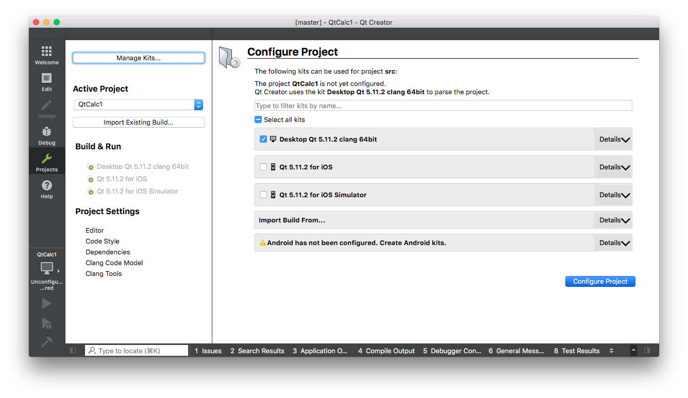
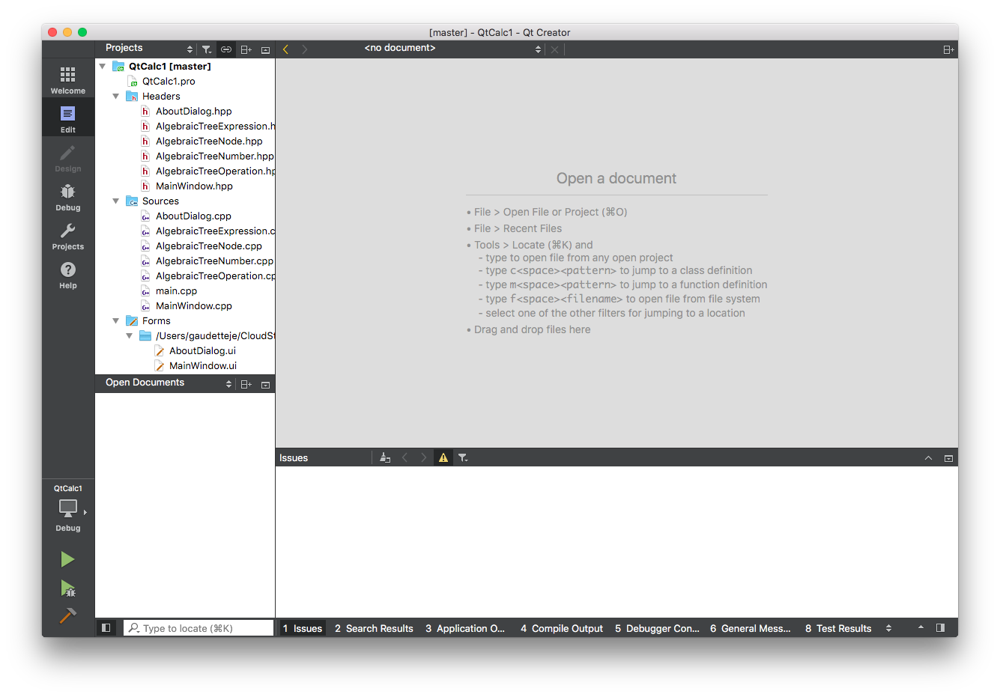
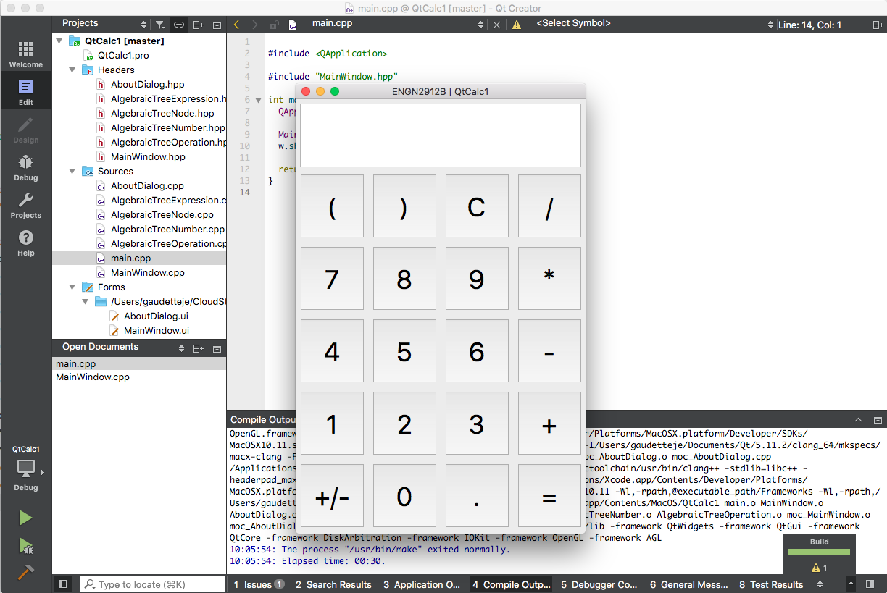
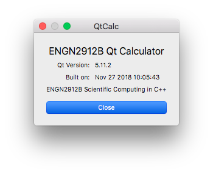

# Classroom examples from Lecture 17 - Qt

This example was built and tested using Qt Creator 4.7.2 (based on Qt 5.11.2) for OSX.  These build instructions should apply for any operating system, since Qt is designed to be cross-platform portable.  Some of these instructions may need to be modified for the Qt Creator version or operating system you are using.  Note that this project can be converted to use CMake rather than the Qt Creator Integrated Development Environment (IDE) or Qt's QMake build tool.

## Open and Configure the Qt Project

Qt Project files (\*.pro) maintain the project's configuration in Qt Creator.  More specifically, the .pro file holds the details about the relative directory structure and any included source files and headres.  It also mantains a list of the XML user interface (.ui) files that contain the GUI specific layout of graphical widgets.

Open the QtCalc1 project by double clicking on the .pro file.  Alternatively, you can open Qt Creator and open the project file by browsing to it.  Qt will ask you to configure the project.  You can select the Desktop version, shown below.

You should be able to monitor the configuration status with the progress bars at the bottom right of the IDE.  Once configuration is complete, Qt creates a .pro.user file, which is an XML document that holds the settings specific to your installation.  You should not include this as part of your git repository, since it is an automatically generated project file and is specific to your local installation.

## Build and Run the Qt Application

You can select and edit the build type (i.e., Debug, Run, Release) by selecting the terminal icon in the lower left corner of Qt Creator.  The green arrows can be used to Run or Debug the application, which will launch an instance of the GUI application.

The Help->About dialog box can be loaded from the menu item in the GUI window.

The compiled application file(s) for your target architecture and operating system can be found in the `bin` directory and moved/distributed as needed.
